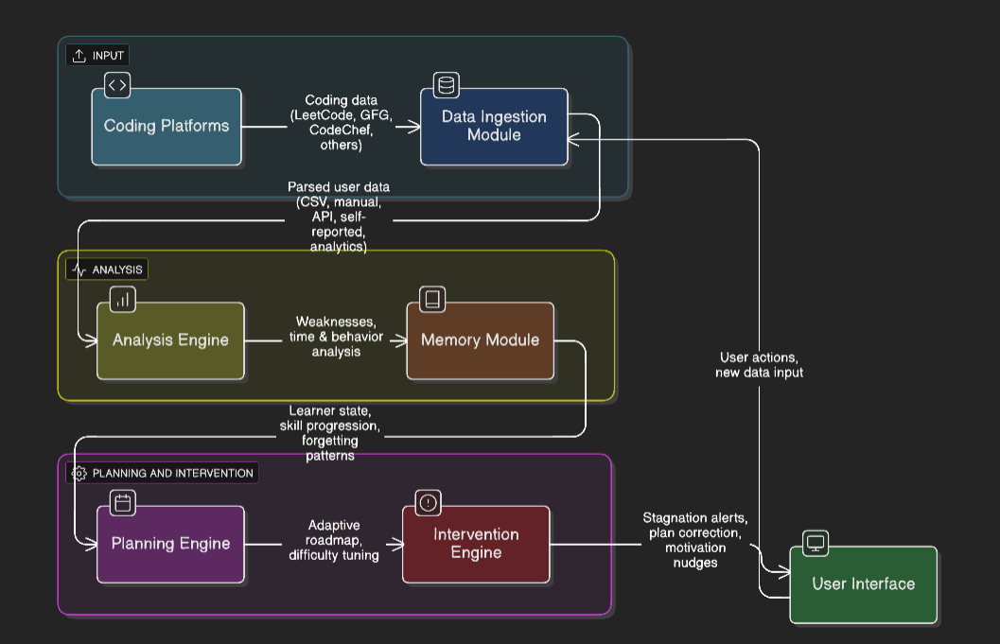

# ai-learning-mentor
Autonomous AI mentor that tracks coding performance, detects weaknesses, and adapts daily learning plans.

**Problem Statement:**
Learning to code effectively for competitive programming and interviews is difficult due to lack of personalized guidance. Existing platforms provide problems and basic statistics but fail to:

Existing platforms provide problems and basic statistics but fail to:
- Identify topic-wise weaknesses accurately
- Analyze solving behavior (time, hesitation, repeated mistakes)
- Adapt daily learning plans dynamically
- Intervene when learners stagnate or deviate from goals
As a result, learners waste time, lose motivation, and plateau.

**Proposed Solution:**
The AI Learning Mentor is an autonomous coach that continuously observes a learner’s coding activity via Pathway streaming engine, analyzes performance, and dynamically plans a personalized daily roadmap. The agent continuously adapts as learners improve or struggle.

**Autonomous Learning Loop**
The mentor operates using a closed-loop autonomous system:
1. **Observe** – Collects coding performance data (problem difficulty, time taken, success rate).
2. **Analyze** – Detects weak topics, slow-solving patterns, and stagnation signals.
3. **Plan** – Generates a personalized daily practice plan.
4. **Intervene** – Adjusts the plan when the learner struggles, improves, or goes off-track.
5. **Learn** – Maintains long-term memory to track skill progression.

**Tech Stack:**
- Pathway Streaming Engine (Live data ingestion & vector store)  
- Python, SQLite (local storage)  
- Rule-based logic + lightweight ML  
- LLM layer: OpenAI / Mistral for reasoning & planning  
- LangGraph / CrewAI (agent orchestration)  
- Streamlit / CLI for visualization

**Architecture Diagram:**

- Data ingestion captures coding activity
- Analysis engine detects weak areas and slow patterns
- Memory module tracks long-term learning trends
- Planning engine generates daily personalized roadmap
- Intervention module adapts plans autonomously
